# pytermwm

[](https://pypi.org/project/pytermwm/)
[](https://pypi.org/project/pytermwm/)
[](https://pypi.org/project/pytermwm/)
[](https://github.com/pez2001/pytermwm/blob/main/LICENSE)

> **1.0.1 is out (2026-09-25):** `pip install pytermwm` now works, plus the `nes`, `matrix` and `dos` themes, SVG
> screenshots and asciicast recordings of the whole screen, much cheaper background effects, and Windows fixes.
> See the [changelog](https://github.com/pez2001/pytermwm/blob/main/CHANGELOG.md) and the
> [announcement](https://github.com/pez2001/pytermwm/discussions/9).

A modern terminal window manager in pure Python ("tmux for 2026"): tiled, floating and docked windows, desktops,
themes, a status line with a built-in prompt, and **four ways to drive it**: the keyboard, a CLI, an HTTP/web API with
a browser UI, and an MCP server so AI agents can operate your terminal.

Runtime dependency: **PyYAML** only (everything else is the standard library). Python 3.9+ on **Linux, macOS and Windows 10 1809+** (ConPTY; Windows Terminal recommended). See [Platforms](#platforms).

```
pipx install pytermwm              # recommended: its own environment, `pytermwm` and `ptw` on your PATH
pip install pytermwm               # or with pip; upgrade later with `pip install -U pytermwm` / `pipx upgrade pytermwm`
pytermwm                           # attach to (or create) the default session
pytermwm --standalone              # everything in one process, no daemon
pytermwm --web 8765                # ... and serve the web UI (prints the URL with its token)
pytermwm doctor                    # check that this machine can run everything
```

`ptw` is a shorter name for the same command, and `python -m pytermwm` works too. Or run straight from a checkout
without installing anything: `pip install -r requirements.txt`, then the wrapper `./ptw ...` on Linux/macOS,
`ptw.cmd ...` or `python ptw.py ...` on Windows.

## Try it in a minute

```
python -m pytermwm attach                      # M-Enter new window, M-h/j/k/l move, M-Space cycle layout, M-/ help
python -m pytermwm up                          # build the workspace from .pytermwm.yaml and attach
python -m pytermwm run -- htop                 # from another shell: open a window in the running session
python -m pytermwm send -t 1 -l -e "ls -la"    # type into window 1 (-l literal text, -e presses Enter)
python -m pytermwm capture -t 1                # read what window 1 shows
python -m pytermwm ctl "layout grid"           # any WM command
python -m pytermwm web                         # print the web UI URL
python -m pytermwm mcp                         # MCP server on stdio for an agent
```

## Screenshots

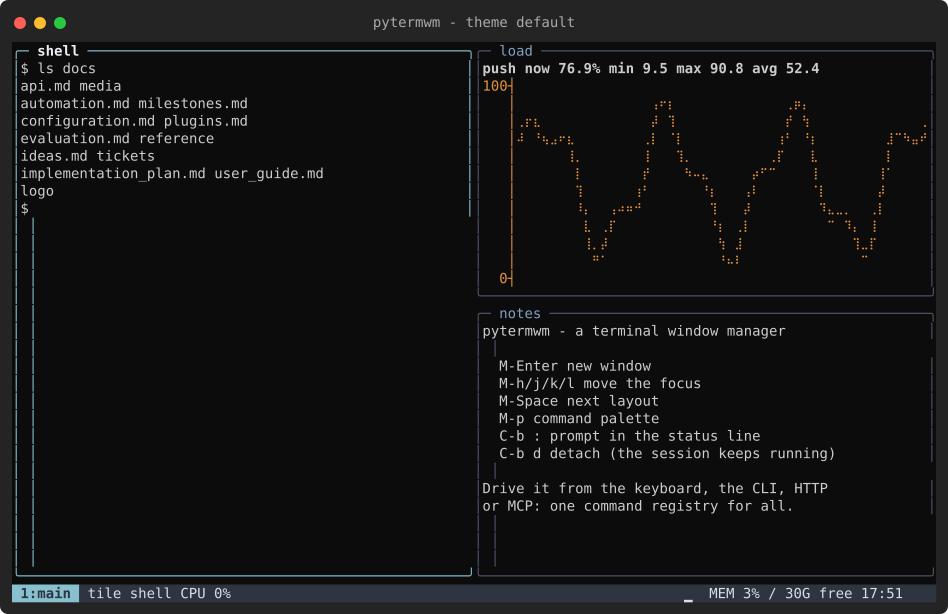

| | | |
|---|---|---|
| 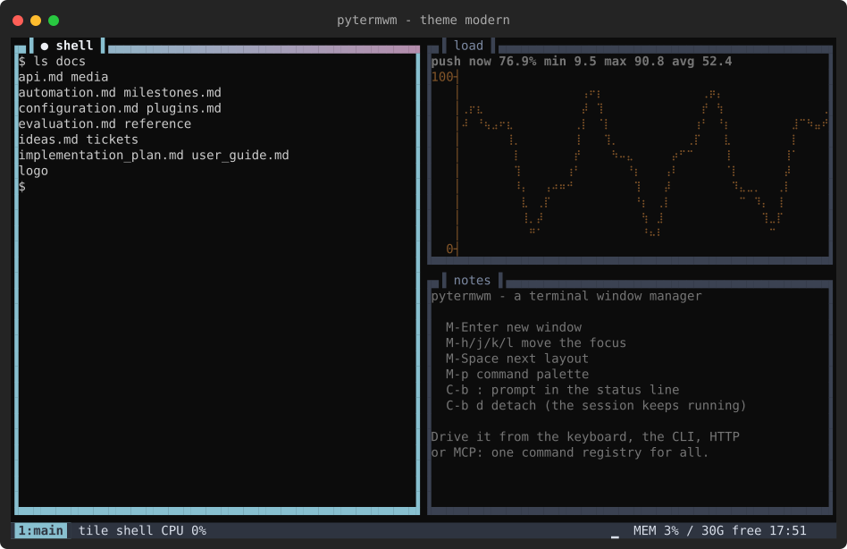 `modern` | 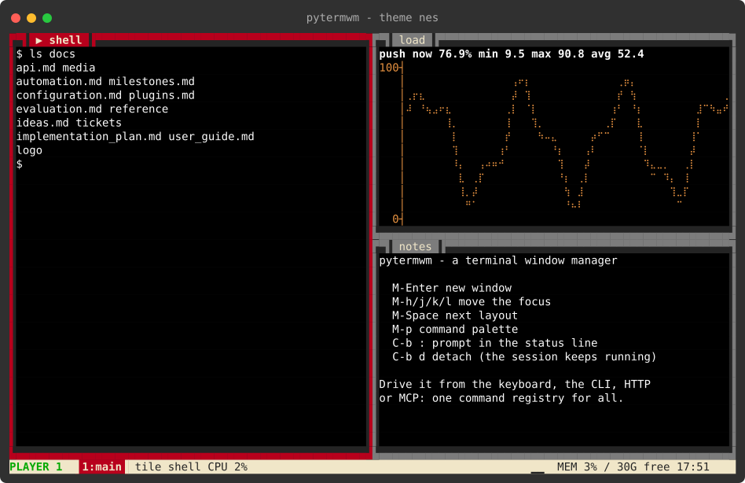 `nes` | 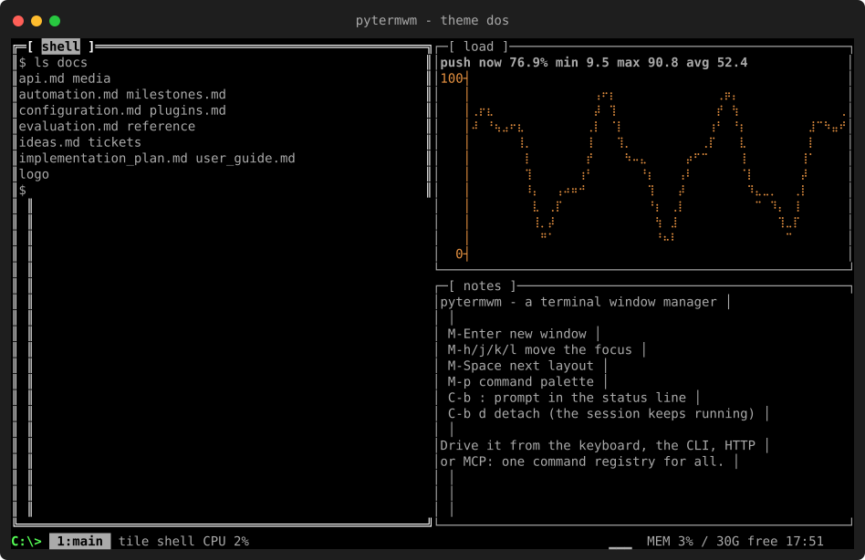 `dos` |
| 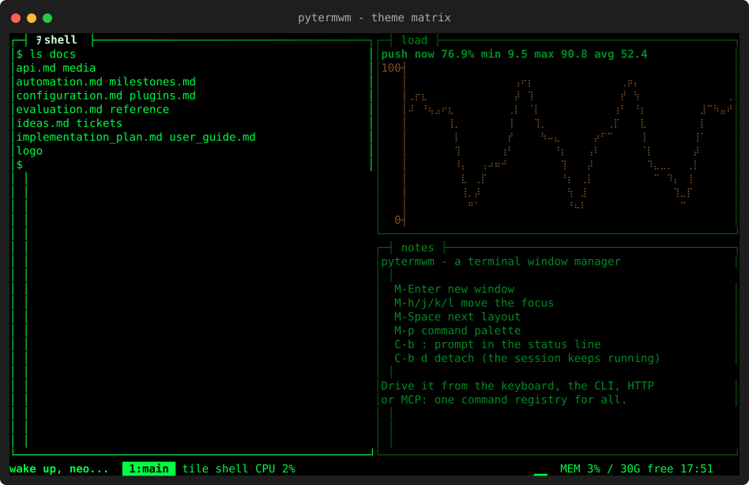 `matrix` | 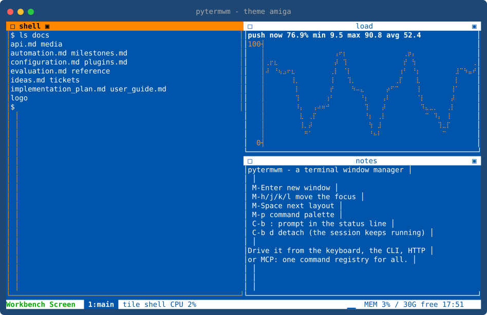 `amiga` | 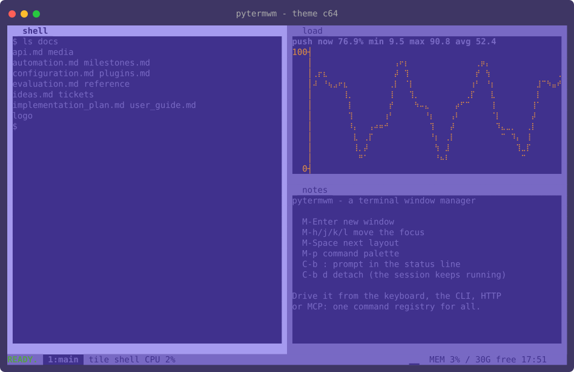 `c64` |
| 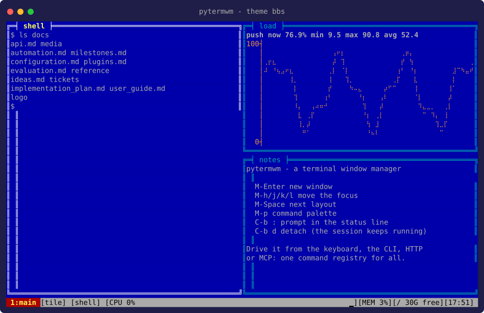 `bbs` | 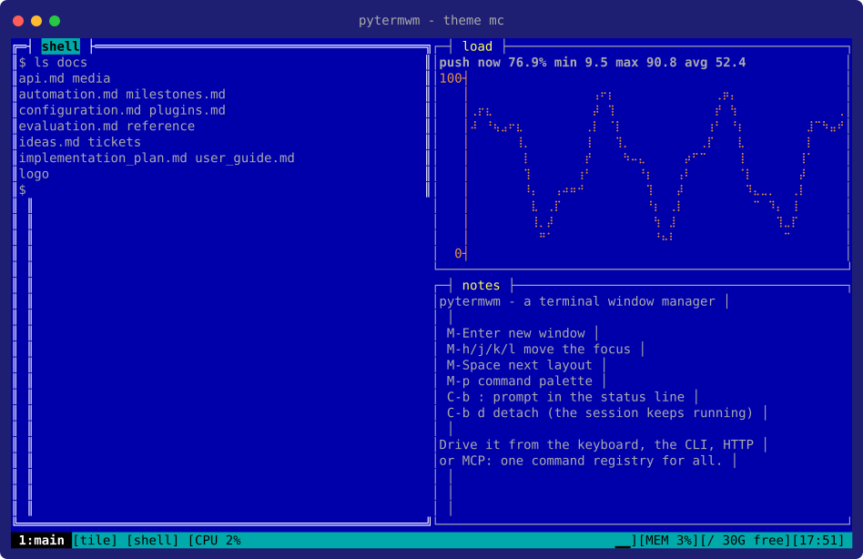 `mc` | 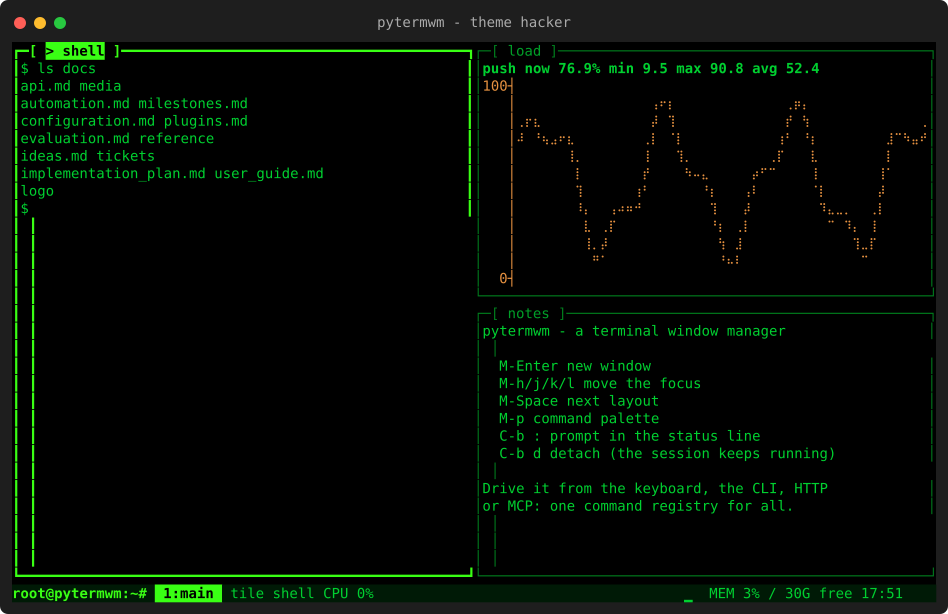 `hacker` |
| 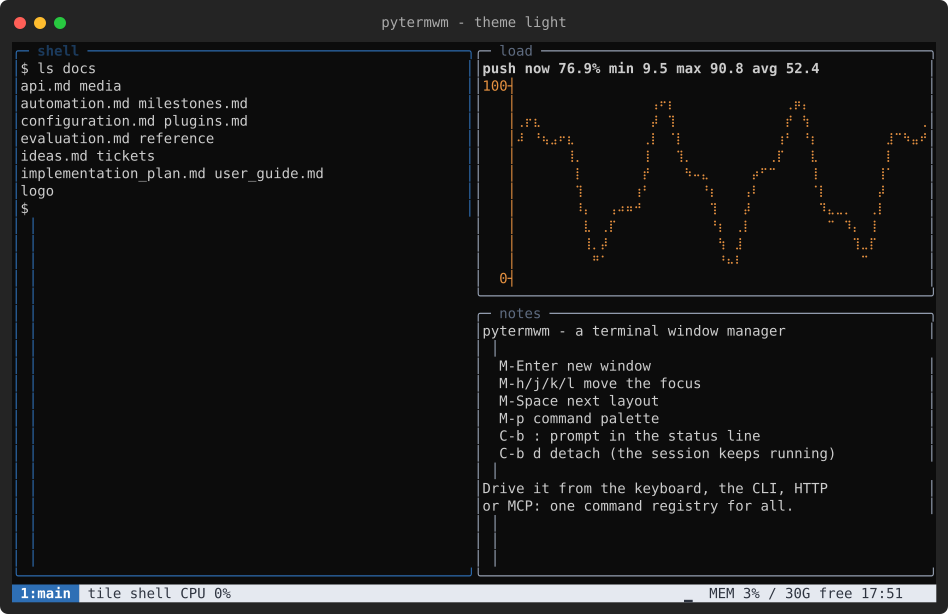 `light` | 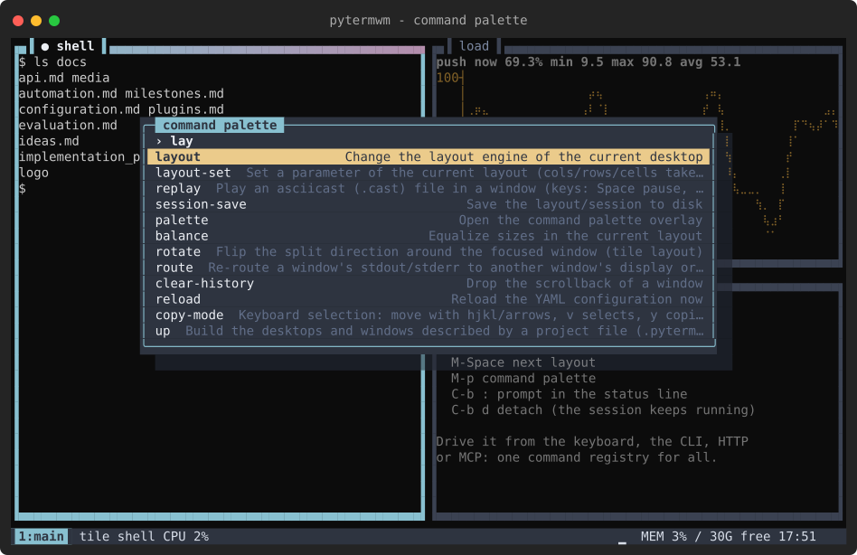 command palette (`M-p`) | 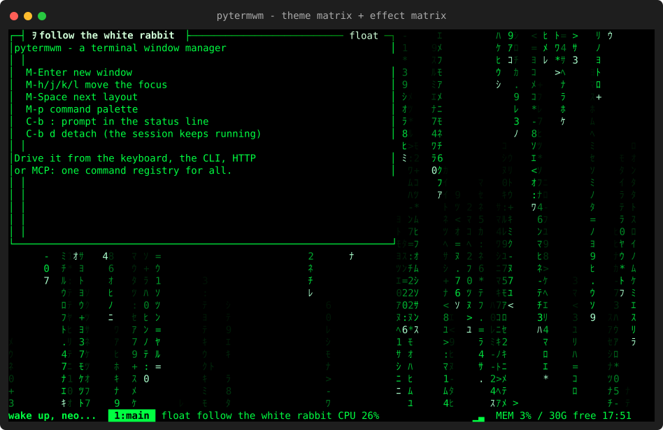 `effect matrix` behind a floating window |

A recorded tour (windows, layouts, the palette, themes, an effect): [docs/media/demo.cast](docs/media/demo.cast) -
play it with `asciinema play docs/media/demo.cast` or inside pytermwm with `replay docs/media/demo.cast`.

### Making screenshots and recordings

Every picture and recording above is generated, not hand-made: `python3 scripts/make_media.py` drives a headless
session through scripted scenes and writes `docs/media/` again (`--only themes|palette|effect|cast`, `--out DIR`).
The recording runs on a virtual clock, so it is the same on a slow or a fast machine.

From a running session (keys, prompt, `pytermwm ctl`, HTTP or MCP) the same is one command:

```
screenshot                       # the whole screen as an SVG in the state directory
screenshot ~/shot.svg            # .svg picture, .ans ANSI art (cat it) or .txt plain text; -f overwrites
record-screen ~/demo.cast        # asciicast v2 of the whole screen: every window, border and the status line
record-screen-stop
record -t 2 ~/win.cast           # just one window's output (record-stop to finish)
```

## What is in the box

| area | what |
|---|---|
| windows | terminal, piped process, file/FIFO tail, text, help, log, status, viewer, dirwatch, chart, debugger; history, virtual size, scrollbars, overflow modes, CP437 conversion |
| layouts | recursive tile, master, spiral, columns, rows, grid, centered, monocle, table (spans), float, docking; multiple desktops |
| look | themes `default light modern hacker bbs mc c64 amiga nes matrix dos` + your own YAML themes; borders, shadows, focus cues, effects (matrix, plasma, starfield, fire, rain, ANSI/ASCII art from a file or directory) |
| UI | status line with pluggable segments, prompt in the status line, command palette, autocompletion, history, dialogs |
| sessions | detachable server, multi-client attach, save/restore |
| control | one command registry shared by hotkeys, prompt, CLI, HTTP, MCP, rules and scripts; scoped tokens (`read`, `agent`) for dashboards and AI agents |
| automation | YAML rules (output/idle/exit/interval/event/status triggers, undo after N seconds) and Python scripts/plugins with hot reload |
| web | live screen with keyboard/mouse/paste, window list, console, config editor, rule builder, script editor, plugin and log views |
| projects | `.pytermwm.yaml` + `pytermwm up` builds a whole workspace (desktops, windows, env) and is safe to repeat |
| recording | asciicast v2 recording of the whole screen (`record-screen`) or any window (`record`), a replay window (`replay`), screenshots as SVG / ANSI / text (`screenshot`) |
| selection | PuTTY-style mouse selection with copy on release, word/line/rectangle modes, keyboard copy mode, paste buffer, OSC 52 and a copy view for terminals without it |
| plugins | docker, btop-style monitor, MQTT (own client), SSH, background effects, OpenAI-compatible chat; write your own in one file |
| I/O | stdio re-routing between windows, `pytermwm pv` progress reporting to the status line, `cmd \| pytermwm pipe` viewers |

## Platforms

| | Linux / macOS | Windows |
|---|---|---|
| terminals | `pty` | ConPTY (ctypes, no extra package) |
| session endpoint | unix socket in `$XDG_RUNTIME_DIR` (0700) | loopback TCP, random port + 128-bit key in `%LOCALAPPDATA%\pytermwm\run\<name>.port` |
| config / state | `~/.config/pytermwm`, `~/.local/state/pytermwm` | `%APPDATA%\pytermwm`, `%LOCALAPPDATA%\pytermwm` |
| default shell | `$SHELL` or `/bin/sh` | `$PYTERMWM_SHELL`, pwsh, powershell, then `%COMSPEC%` |
| system stats | `/proc` | Win32 API and `tasklist` (no load average / network counters) |

`!shell` rule actions quote variables for the platform's shell; on Windows characters that cmd/PowerShell treat
specially are replaced by `_`. `PYTERMWM_THREADED_IO=1` and `PYTERMWM_TCP=1` switch a Linux box to the Windows I/O
model, which is how the Windows code paths are tested without Windows.

## Documentation

* [User guide](docs/user_guide.md) - concepts, keys, prompt, sessions, everyday recipes
* [Configuration](docs/configuration.md) - every YAML key with examples
* [Automation](docs/automation.md) - rules and scripts
* [Plugins](docs/plugins.md) - bundled plugins and how to write one
* [Control API](docs/api.md) - socket ops, HTTP/SSE, MCP, security model
* [Command reference](docs/reference/commands.md) and [MCP tools](docs/reference/mcp.md) (generated)
* [Contributing](CONTRIBUTING.md) - bug reports, setting up, tests, generated files, pull requests
* Project management: [evaluation](docs/evaluation.md), [implementation plan](docs/implementation_plan.md),
  [milestones](docs/milestones.md), [tickets](docs/tickets/), [ideas](docs/ideas.md)

## Tests

```
./run_tests                  # or run_tests.cmd / python run_tests.py; no install needed (-k PATTERN, -v, -f, --list)
./run_tests --threaded-io --tcp   # the whole suite in the Windows I/O model
python scripts/smoke.py      # end-to-end check of the real CLI/daemon/HTTP/MCP (any OS)
./ptw doctor                 # environment check
```

On Windows `run_tests` runs the portable subset by default (`--all` for everything); a few tests need a POSIX shell.
GitHub Actions (`.github/workflows/ci.yml`) runs Linux, macOS and Windows.

The browser test in `tests/test_web_ui.py` runs only when `playwright` and a Chromium are installed (set
`PTW_CHROMIUM` to the binary); it is skipped otherwise.

## Releasing

1. Set `__version__` in `pytermwm/__init__.py`, move the `Unreleased` entries in [CHANGELOG.md](CHANGELOG.md) under a
   `## [X.Y.Z] - date` heading, and merge that to `main`.
2. Push the tag: `git tag -a vX.Y.Z -m "pytermwm X.Y.Z" && git push origin vX.Y.Z`. `.github/workflows/release.yml`
   checks the tag against the code and the changelog, builds the sdist and wheel, uploads them to PyPI with Trusted
   Publishing, then creates the GitHub release (the changelog section as its notes, marked "Latest") and announces it
   in Discussions → Announcements. Publishing a release in the GitHub web UI creates the tag and does the same.

One-time setup on pypi.org: Account → Publishing → add a (pending) publisher for owner `pez2001`, repository
`pytermwm`, workflow `release.yml`, environment `pypi`. To try a build locally: `pip install build twine`,
`python -m build`, `twine check dist/*`.

## Security notes

The web server binds to `127.0.0.1` and requires a random token (Bearer header, or `?token=` once which becomes an
HttpOnly SameSite=Strict cookie). Host and Origin are checked, so DNS-rebinding and cross-site requests are refused.
`eval` and the python console are off unless `allow_eval: true`. Rule variables are shell-quoted. Read
[docs/api.md](docs/api.md#security-model) before binding to another interface.
